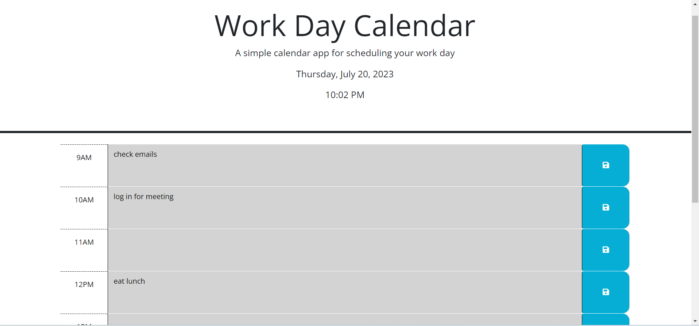
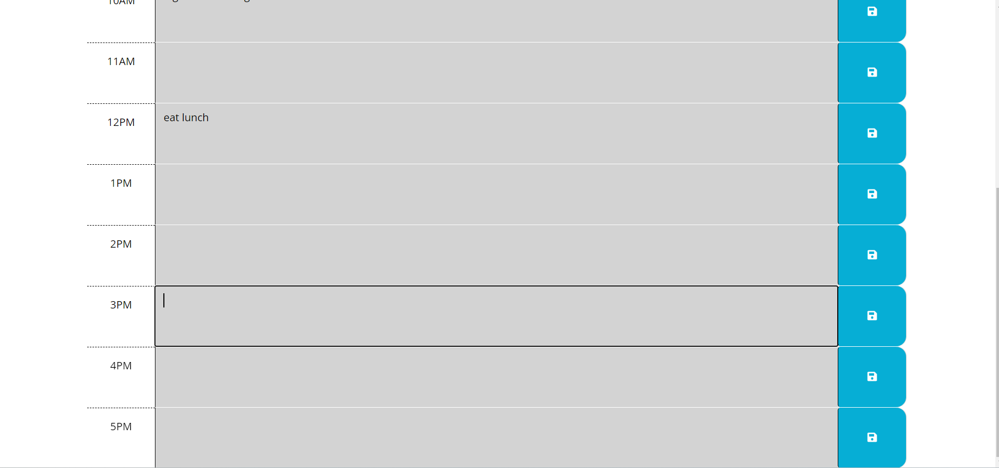

# Work-Day-Calendar

## Description

A simple calendar app for scheduling your work day. The Work Day Calendar allows you to plan and organize your daily tasks by hour, helping you stay on top of your work schedule. 

## Usage

When you open the page, you will see the current date and time displayed in the header.
Time blocks are shown for each hour of the workday, starting from 9 AM to 5 PM.
Enter your task in the corresponding time block.
To save your task, click the "Save" button (disk icon) to the right. Your description will be saved to local storage.
The time blocks are color-coded to indicate whether they are in the past, present, or future based on the current time. Gray is past, red is current, and green is future. 
Refreshing the page will load your saved tasks, and the time blocks will be updated to show the current time.

https://mlek10.github.io/Work-Day-Calendar/

